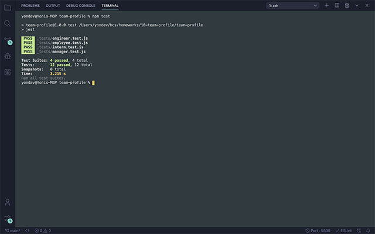

# Team Profile Generator/ team-profile

[](https://opensource.org/licenses/Apache-2.0)[](https://opensource.org/licenses/MIT)

- <a href="https://github.com/yondav/team-profile">Repo</a>

## About / Synopsis

Team Profile Generator is an easy to use command line application to generate a quick profile page for your team. The application will prompt the user to input the parameters of each of their team members and take output a styled HTML page featuring the team member's name, role and contact information.

- Managers will also have an office phone number linked
- Engineers will also have their github profile linked
- Interns will also display the school they are enrolled in

---

## Table of contents

> - [Title / Repository Name](#title--repository-name)
>   - [About / Synopsis](#about--synopsis)
>   - [Table of contents](#table-of-contents)
>   - [Installation](#installation)
>   - [Usage](#usage)
>     - [File Path](#file-path)
>     - [Supported Commands](#supported-commands)
>     - [Flow](#flow)
>   - [Live Demo](#live-demo)
>   - [Test instructions](#test-instructions)
>   - [Author](#author)
>     - [Contact](#contact)
>   - [Contributing / Issues](#contributing--issues)
>     - [Contributing](#contributing)
>     - [Known Issues](#known-issues)
>     - [Reporting Issues](#reporting-issues)
>   - [License](#license)

---

## Installation

- Clone repo
- Open integrated terminal on the root directory
- Install dependencies

```
npm i
```

---

## Usage

> ### File Path
>
> The app will generate a new directory in the root directory named dist when the application is finished running. The rendered HTML and CSS pages will be printed inside the new directory
>
> - root directory
>   - \_tests
>     - employee.test.js
>     - engineer.test.js
>     - intern.test.js
>     - manager.test.js
>   - _node_modules_
>   - images
>   - lib
>     - employee.js
>     - engineer.js
>     - intern.js
>     - manager.js
>   - samples
>     - _sample html and css files_
>   - src
>     - questions.js
>     - renderCSS.js
>     - renderHTML.js
>   - .gitignore
>   - index.js
>   - package-lock.json
>   - package.json
>   - README.md
>   - **NEW DIRECTORY: dist**
>     - team.html
>     - style.css

---

### Supported Commands

This is a command line app. The user will be able to input their responses in a single line format when prompted and use the return key to submit.

For list prompts, the user will be able to navigate the options using the arrow keys and submit using the return key when the desired selection is made.

For confirm prompts, the user will use `y/n` to make their selection and return to submit.

---

### Flow

To start the application, user can either run

```
npm start
```

or

```
node index.js
```

The user will be prompted, asking if they would like to add an employee followed by a series of prompts to fill out the team member's information.

There will be a specific prompt pertaining to each available role.

Once the user is done, they can simply select `n` when prompted to add another employee, at which point the application will write the `team.html` and `style.css` files in a new directory `dist`.

---

### Sample Page


## Live Demo

<a href="https://youtu.be/ZjA82UpRFCQ">Full Video Demo</a>


---

## Test Instructions

Test files can be found in the `test` directory. Currently passing all written tests for object classes.



Open to improvements and implementing testing across the rest of the application's logic.

---

## Author

- <a href="https://yondav.us/">Yoni David</a>
- <a href="https://github.com/yondav">Github</a>

---

### Contact

Send emails to <a href="mailto:yoni@yondav.us">yoni@yondav.us</a>

## Contributing / Issues

---

### Contributing

- Fork repo
- Make additions and changes on new, personalized branch
- Pull request and submit for review

---

### Known Issues

Currently no known issues.

---

### Reporting Issues

Report issues by selecting the <a href="https://github.com/yondav/team-profile/issues">issues</a> tab and creating a new issue

---

## Licenses

- <a href="https://www.apache.org/licenses/LICENSE-2.0" target="_blank">Apache 2.0</a>

- <a href="https://opensource.org/licenses/MIT" target="_blank">MIT</a>

This README file was built with <a href="https://github.com/yondav/README-gen-09">README Generator</a>

Copyright &copy; 2021, Yoni David
